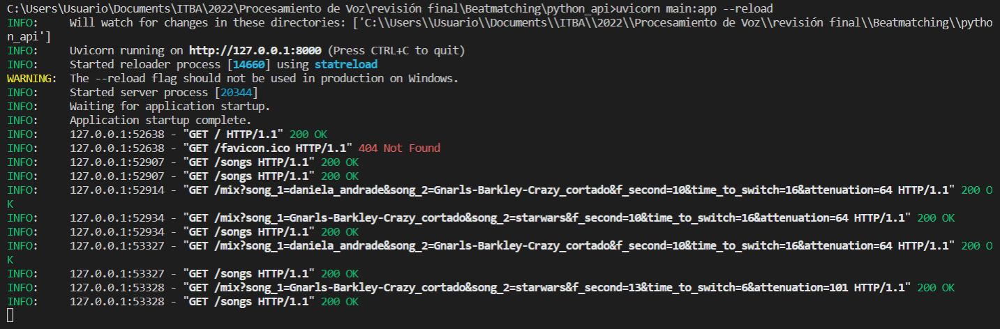
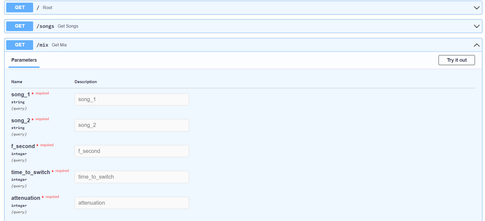

# Beatmatching

This repository contains an application that consist in a frontend that allow the user to select two music from a list of titles and then play the song that mix them with a smooth transition between them. 

Although the application has a reduced number of songs, it works well with every sound that you want to use and the system adapts the transitions between them automatically, you just have to introduce the BPMs of the song to let the system know the speed of the song. 

The system is separated in 2 blocks, the frontend and the backend, the frontend is made using ReactJS framework and the backend is made using FastApy library.

This software is part of a project of the Voice Processing subject for the Electronic Engineering course at the Instituto Tecnológico de Buenos Aires (ITBA). 

## Preview

### Frontend Image


### Backend Image





### Video


## Getting Started

To run this app first you have to download the code, to do that write this in your terminal in the folder where you want to have the code.

```
git clone https://github.com/matifrancois/Beatmatching.git
```

Then you have to get into the beatmatching folder and you will have to open 2 terminals to run this app, one for the frontend and the other one for the backend of this app.

### Backend:

To run the backend open a terminal inside the folder python_api and then run the next command to have the necessary requirements installed to run this application.

```
pip install -r requirements.txt
```

We strongly recommend you to have a environment set for this project, if you don't known how to make it you can search online or in [this repo](https://github.com/matifrancois/Virtual-Enviroments-Python-Jupyter) that has the principal commands to make that possible in windows.

When you have the necessary libraries installed you can run the backend of this application by running the following command:

```
uvicorn main:app --reload
```

### Frontend:

After you get the backend up and running, (and with it still running) you can run the frontend, to do that you need to open another terminal in the frontend folder and then run this command to get the necessary libraries.

```
npm install 
```

Then you can run the frontend with the following command:

```
npm start 
```